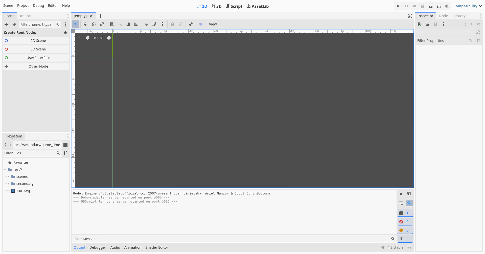
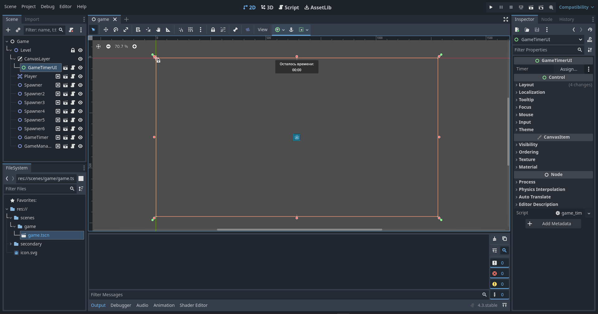

# Realization

> 📝 Please be advised!
>
> This project is an approximate representation of the idea described here: [2D Top-Down Simple Shooter](idea-en.md)

## Table of Contents

- [A quick tour of the Godot interface](#a-quick-tour-of-the-godot-interface)
- [Initial project structure](#initial-project-structure)
- [Project Setup](#project-setup)
- [Creating a level scene](#creating-a-level-scene)
- [Creating a player](#creating-a-player)
  - [Player's code](#players-code)
- [Creating a bullet](#creating-a-bullet)
  - [Bullet's code](#bullets-code)
  - [Let's supplement the player's code](#lets-supplement-the-players-code)
- [Creating an enemy](#creating-an-enemy)
  - [Enemy's code](#enemys-code)
- [Testing](#testing)
- [Creating an enemy spawn point](#creating-an-enemy-spawn-point)
  - [Spawner's code](#spawners-code)
- [Creating a timer](#creating-a-timer)
  - [Timer's code](#timers-code)
- [Creating a timer interface](#creating-a-timer-interface)
  - [Timer interface's code](#timer-interfaces-code)
- [Creating a manager](#creating-a-manager)
  - [Preparation](#preparation)
  - [Manager's code](#managers-code)
- [What's next?](#whats-next)
- [Some discoveries 🎆](#some-discoveries-)

## A quick tour of the Godot interface

[Back to Contents](#table-of-contents)


<p align="center">Figure 1 – Standard Editor Interface Layout</p>


<p align="center">Figure 2 – Example of Direct Work in the Editor</p>

In brief:

- Top left: scene, project, debugging, and editor menu blocks, as well as help and engine information display menu block;
- Top left: `Scene` – current scene tree, `Import` – project resource import settings;
- Bottom left: `Filesystem` – project tree;
- Top center: `2D` – current scene view in 2D space (2D games, graphical interface), `3D` – current scene view in 3D space (3D games), `Script` – code editing (hints only for GDScript), `AssetLib` – public resource library;
- Center: open scene tabs, toolbar, scene view, and interaction with its nodes;
- Bottom center: `Output` – debug information output panel, `Debugger` – project debugging tool panel, `Audio` – project mixer panel, `Animation` – animation track interaction panel, `Shader Editor` – shader editor panel
- Top right: project launch buttons – launch the entire project, pause the launched project, stop the project, remotely launch the project (Web, Android), launch the currently edited scene, launch a specific scene using the scene selection window, enable the project recording feature using engine tools, select the project rendering method (`Forward+` – uses `Vulkan`, only for desktop devices; `Mobile` – uses `Vulkan`, for PC / mobile devices; `Compatibility` – uses `OpenGL 3`, for PC / mobile devices and Web platforms);
- Right: `Inspector` – view properties of the selected scene node, interact with and view documentation of its class; `Node` – view and interact with signals and groups of the selected node; `History` – view the history of changes within the scene and/or the entire project.

## Initial project structure

[Back to Contents](#table-of-contents)

- Root
  - `scenes` folder
  - `secondary` folder
  - `icon.svg` file (#table-of-contentsault)

## Project Setup

[Back to Contents](#table-of-contents)

In the project settings, I do the following: (`Project` ➡ `Project Settings`)

- In the `General` tab, I change the values
  - `Viewport Width` and `Viewport Height` (`Display` ➡ `Window` ➡ `Size`) to `1280` and `720`, respectively
  - `Mode` and `Aspect` (`Display` ➡ `Window` ➡ `Stretch`) to `canvas_items` and `expand`, respectively
- In the `Input Map` tab, I add actions (`Add New Action` field):
  - `forward`: `W` and `Up` (up arrow), `backward`: `S` and `Down` (down arrow), `right`: `D` and `Right` (right arrow), `left`: `A` and `Left` (left arrow)
    - All have `Keycode (Latin Equivalent)` selected
  - `shoot`: `LMB` (Left Mouse Button)

## Creating a level scene

[Back to Contents](#table-of-contents)

In general, the parent object type can be both `Node` and `Node2D`. In my case, let it be `Node`.
The structure will be as follows:

- `Game` (type `Node`)
  - `Level` (type `Node2D`)
    - `CanvasLayer`

> As you read, you can independently add the player, enemies, etc. to the level. You can occasionally move to the "[Testing](#testing)" subtitle.

Save the scene in a new `game` folder inside the `scenes` folder, with a corresponding scene name.

## Creating a player

[Back to Contents](#table-of-contents)

I didn't use the `CharacterBody2D` node; instead, I used `Area2D`. It's taken into account that each node inside the player has a position of `(x: 0, y: 0)`.
The structure will be as follows:

- `Player` (type `Area2D`)
  - `Sprite2D`: used `icon.svg` as the sprite, node scale: `(x: 0.25, y: 0.25)`
  - `CollisionShape2D` (using `RectangleShape2D` with a size of `(x: 30, y: 30)`)
  - `ShootDelay` (type `Timer`; wait time: `0.15`, `One Shot`: `true`)

Save the scene in a new `player` folder inside the `secondary` folder, with a corresponding scene name.
Add an empty GDScript to the parent `Player` node with an identical name to the object.

### Player's code

```gdscript
class_name Player extends Area2D

# const BULLET

var health := 10

var speed := 100.0
var speed_multiplier := 3.0

@onready var shoot_delay: Timer = $ShootDelay

func _physics_process(delta: float) -> void:
	# Creates a direction vector from (-1,-1) to (1,1)
	# Directions:
	# - Negative values: left, forward;
	# - Positive values: right, backward;
	# Explained by the fact that the coordinate (0,0) is the top-left corner of the screen
	# Horizontally (left to right): (-X,0,X+)
	# Vertically   (top to bottom): (-Y,0,Y+)
	var direction_x := Input.get_axis("left", "right")
	var direction_y := Input.get_axis("forward", "backward")
	
	var velocity := Vector2(direction_x, direction_y)
	velocity = velocity.normalized()
	velocity = velocity * speed * speed_multiplier * delta
	
	position += velocity

func take_damage(value: int) -> void:
	health -= value
	print("Player health: ", health)
	_check_damage()

func _check_damage() -> void:
	if health <= 0:
		print("Player died!")
		queue_free()
```

## Creating a bullet

[Back to Contents](#table-of-contents)

The structure will be as follows:

- `Bullet` (type `Area2D`)
  - `Sprite2D`: used `icon.svg` as the sprite, enabled `Region`, `region_rect`: `(x: 34, y: 40, w: 60, h: 60)`, node scale: `(x: 0.1, y: 0.1)`, `modulate` (`Visibility` tab): `00ff00` (green)
  - `CollisionShape2D` (using `RectangleShape2D` with a size of `(x: 7, y: 7)`)
  - `VisibleOnScreenNotifier2D`
  - `Timer` (`One Shot`: `true`)

Save the scene in a new `bullet` folder inside the `secondary` folder, with a corresponding scene name.
Add an empty GDScript to the parent `Bullet` node with an identical name to the object.

### Bullet's code

```gdscript
class_name Bullet extends Area2D

var damage := 1

var speed := 100.0
var speed_multiplier := 5.0

@onready var timer: Timer = $Timer

func _physics_process(delta: float) -> void:
	position += transform.x * speed * speed_multiplier * delta

# Connect the "screen_exited" signal of "VisibleOnScreenNotifier2D"
func _on_visible_on_screen_notifier_2d_screen_exited() -> void:
	timer.start()

# Connect the "timeout" signal of "Timer"
func _on_timer_timeout() -> void:
	queue_free()
```

### Let's supplement the player's code

Uncomment the `const BULLET` line by removing the `#` and complete it:

```gdscript
const BULLET := preload("res://secondary/bullet/bullet.tscn")
```

Also, add code to the `_physics_process` function:

```gdscript
func _physics_process(delta: float) -> void:
	# Previous code above remains unchanged

	if Input.is_action_pressed("shoot"):
		if shoot_delay.is_stopped():
			var bullet := BULLET.instantiate()
			bullet.global_position = global_position
			bullet.look_at(get_global_mouse_position())
			get_parent().add_child(bullet)
			shoot_delay.start()
```

## Creating an enemy

[Back to Contents](#table-of-contents)

The structure will be as follows:

- `Enemy` (type `Area2D`)
  - `Sprite2D`: used `icon.svg` as the sprite, node scale: `(x: 0.25, y: 0.25)`, `modulate` (`Visibility` tab): `ff0000` (red)
  - `CollisionShape2D` (using `RectangleShape2D` with a size of `(x: 32, y: 32)`)
  - `DamageDelay` (type `Timer`; `One Shot`: `true`)

Save the scene in a new `enemy` folder inside the `secondary` folder, with a corresponding scene name.
Add an empty GDScript to the parent `Enemy` node with an identical name to the object.

### Enemy's code

```gdscript
class_name Enemy extends Area2D

const SPEED_MULTIPLIER_MIN := 1.0
const SPEED_MULTIPLIER_MAX := 2.5

const HEALTH_MIN := 1
const HEALTH_MAX := 5

# Made it public at the editor level
# so it's convenient to attach the player at the initial stage
@export var player: Player
var is_touches_player: bool

var speed := 100.0
var speed_multiplier: float

var damage := 1

var health: int

@onready var damage_delay: Timer = $DamageDelay

func _ready() -> void:
	speed_multiplier = randf_range(SPEED_MULTIPLIER_MIN, SPEED_MULTIPLIER_MAX)
	health = randi_range(HEALTH_MIN, HEALTH_MAX)

func _physics_process(delta: float) -> void:
	var velocity := Vector2.ZERO
	
	# Chase the player only when they exist (haven't died)
	if is_instance_valid(player):
		var target_position := player.global_position
		velocity = global_position.direction_to(target_position)
		velocity = velocity * speed * speed_multiplier * delta
		position += velocity

func _take_damage(value: int) -> void:
	health -= value
	print("%s health: %s" % [name, health])
	_check_health()

func _check_health() -> void:
	if health <= 0:
		print("%s died!" % [name])
		queue_free()

# Connect the "area_entered" signal of "Enemy"
func _on_area_entered(area: Area2D) -> void:
	if area is Bullet:
		_take_damage(area.damage)
		area.queue_free()
	if area is Player:
		is_touches_player = true
		if damage_delay.is_stopped():
			player.take_damage(damage)
			damage_delay.start()

# Connect the "area_exited" signal of "Enemy"
func _on_area_exited(area: Area2D) -> void:
	if area is Player:
		is_touches_player = false

# Connect the "timeout" signal of "DamageDelay"
func _on_damage_delay_timeout() -> void:
	if is_touches_player:
		player.take_damage(damage)
		damage_delay.start()
```

## Testing

[Back to Contents](#table-of-contents)
> As you read, you might have already tested the player, bullet, and enemy functionality, but maybe some questions arose.

Return to the `Game` scene, click on the `Level` node, `Right-click` ➡ `Instantiate Child Scene...`, to add objects to the level. For example, after adding `Player` to the level, let's move it to the center of the screen by changing the `position` to `(x: 1280 / 2, y: 720 / 2)`, and place `Enemy` somewhere near the player, go to the enemy's properties and find the `Player` property. As I mentioned in the enemy's code comments, `@export` allows you to see the variable `player` at the editor level.

Click on the `Assign...` button next to the `Player` property and in the opened node selection window, select the single `Player` node on the level.

Press the `F5` key to run the project. On the first press, the engine will ask which scene to make the main one (which scene will be launched first). You can manually select (button `Select`), you can select the one being edited at the moment (if you were last in the `Game` scene, the `Game` scene will be selected; button `Select Current`), or you can not select anything, press the `Cancel` button, and press the `F6` key to run the currently edited scene.

> But sooner or later, you'll need to choose a main scene to launch the game 😊

As we did at the very beginning, the character is controlled using `WASD` or arrow keys on the keyboard, and shooting is done using the `LMB`.

## Creating an enemy spawn point

[Back to Contents](#table-of-contents)

The structure will be as follows:

- `Spawner` (type `Node2D`)
  - `Delay` (type `Timer`; `One Shot`: `true`)

Save the scene in a new `spawner` folder inside the `secondary` folder, with a corresponding scene name.
Add an empty GDScript to the parent `Spawner` node with an identical name to the object.

### Spawner's code

```gdscript
class_name Spawner extends Node2D

const SPAWN_COUNT_MIN := 1
const SPAWN_COUNT_MAX := 5

const SPAWN_DELAY_MIN := 5.0
const SPAWN_DELAY_MAX := 10.0

const ENEMY := preload("res://secondary/enemy/enemy.tscn")

@export var enable: bool = true
@export var player: Player

@onready var delay: Timer = $Delay

func _ready() -> void:
	_rand_delay_time()

func _rand_delay_time() -> void:
	if not delay.is_stopped():
		delay.stop()
	delay.wait_time = randf_range(SPAWN_DELAY_MIN, SPAWN_DELAY_MAX)
	delay.start()

# Connect the "timeout" signal of "Delay"
func _on_delay_timeout() -> void:
	if is_instance_valid(player) and enable:
		if not delay.is_stopped():
			delay.stop()
		var rand_count := randi_range(SPAWN_COUNT_MIN, SPAWN_COUNT_MAX)
		for i: int in range(rand_count):
			var enemy := ENEMY.instantiate()
			var rand_position := Vector2(randf_range(-10, 10), randf_range(-10, 10))
			enemy.player = player
			enemy.global_position = global_position + rand_position
			get_parent().add_child(enemy)
		_rand_delay_time()
```

> You can try this object in action! Add it to the level and attach its `Player` property to the player. You can remove the individual enemy and also duplicate the spawner and place objects here and there.

## Creating a timer

[Back to Contents](#table-of-contents)

The structure will be as follows:

- `GameTimer` (type `Node2D`)
  - `Delay` (type `Timer`)

We also need to add this object to a specific group. Click on the parent node (`GameTimer`), click on the `Node` tab ➡ `Groups` ➡ `+` ➡ name the group `GameTimer` ➡ `OK`. The created group will be needed in the future.
Save the scene in a new `game_timer` folder inside the `secondary` folder, with a corresponding scene name.
Add an empty GDScript to the parent `GameTimer` node with an identical name to the object.

### Timer's code

```gdscript
class_name GameTimer extends Node2D

signal timeout

@export var seconds: int = 60
var time_left: int

@onready var delay: Timer = $Delay

func _ready() -> void:
	time_left = seconds
	delay.start()

func _check() -> void:
	if time_left <= 0:
		delay.stop()
		timeout.emit()

# Connect the "timeout" signal of "Delay"
func _on_delay_timeout() -> void:
	time_left -= 1
	_check()
```

I think you've noticed something new. We #table-of-contentsined a `timeout` signal for the timer. It will come in handy when we create a [manager](#creating-a-manager).

## Creating a timer interface

[Back to Contents](#table-of-contents)

Do we need to see the remaining time on the timer? Of course!
The structure will be as follows:

- `GameTimerUI` (type `Control`): stretch the node to full screen of the scene: `Layout` ➡ `anchors_preset`: `Full Rect`; this can also be done using the selected buttons at the end of the toolbar under the scene tabs (Figure 3)
  - `Margin` (type `MarginContainer`): change the margin values from the screen edges to the middle: `Theme Override` ➡ `Constants`: `10`
    - `VBox` (type `VBoxContainer`)
      - `HBox` (type `HBoxContainer`, `Alignment`: `Center`)
        - `Panel` (type `PanelContainer`)
          - `Margin` (type `MarginContainer`): `Theme Override` ➡ `Constants`: `Margin Left / Right`: `20`, `Margin Top / Bottom`: `5`
            - `VBox` (type `VBoxContainer`)
              - `TimerName` (type `Label`): text `Time remaining:`, `Horizontal Alignment`: `Center`, `Right-click` on the node ➡ `Access as Unique Name`
              - `TimerInfo` (type `Label`): text `00:00` (you can leave it blank), `Horizontal Alignment`: `Center`, `Right-click` on the node ➡ `Access as Unique Name`
  - `Timer` (`Autostart`: `true`)


<p align="center">Figure 3 – Stretch the node to full screen of the scene</p>

Save the scene in a new folder `game_timer_ui` inside the `secondary` folder, with a corresponding name.
Add an empty GDScript to the parent node `GameTimerUI` with the same name as the object.

### Timer interface's code

```gdscript
class_name GameTimerUI extends Control

@export var timer: GameTimer

@onready var timer_name: Label = %TimerName
@onready var timer_info: Label = %TimerInfo

func _process(_delta: float) -> void:
	if is_instance_valid(timer):
		var raw_seconds := timer.time_left
		var minutes: int = floor(float(raw_seconds % 3600) / 60)
		var seconds: int = raw_seconds % 60
		timer_info.text = "%02d:%02d" % [minutes, seconds]

# Connect the "timeout" signal of the "Timer"
func _on_timer_timeout() -> void:
	if not is_instance_valid(timer):
		timer = get_tree().get_first_node_in_group("GameTimer")
```

> You can test the timer and its interface. `GameTimer` should be a child object of `Level`, and `GameTimerUI` – `CanvasLayer`.

## Creating a manager

[Back to Contents](#table-of-contents)

We've finally reached the final part! Let's create a manager that will be subscribed to the `timeout` signal of `GameTimer`, find enemy spawners, enemies themselves, and the player on the level.
The structure will be as follows:

- `GameManager` (type `Node2D`)

Save the scene in a new folder `game_manager` inside the `secondary` folder, with a corresponding name.

### Preparation

Before we write code for the manager, let's go back to the created objects and add each of the following to its group:

| Objects   | Groups    |
| --------- | --------- |
| Player    | Player    |
| Enemy     | Enemy     |
| Spawner   | Spawner   |
| GameTimer | GameTimer |

Using groups, the manager will find the necessary objects on the level and interact with them.

### Manager's code

Add an empty GDScript to the parent node `GameManager` with the same name as the object.

```gdscript
class_name GameManager extends Node2D

@export var player: Player

var game_over: bool

func _ready() -> void:
	var timer: GameTimer = get_tree().get_first_node_in_group("GameTimer")
	if timer:
		timer.timeout.connect(_on_timeout)
	else:
		push_error("No timer on the scene!")
	
	if not is_instance_valid(player):
		player = get_tree().get_first_node_in_group("Player")
		if not player:
			push_error("No player on the scene!")
	
	var spawners := get_tree().get_nodes_in_group("Spawner")
	for spawner: Spawner in spawners:
		spawner.player = player

func _process(_delta: float) -> void:
	if game_over:
		var enemies := get_tree().get_nodes_in_group("Enemy")
		if enemies.size() > 0:
			for enemy: Enemy in enemies:
				enemy.queue_free()

func _on_timeout() -> void:
	game_over = true
	var spawners := get_tree().get_nodes_in_group("Spawner")
	for spawner: Spawner in spawners:
		spawner.enable = false
```

## What's next?

[Back to Contents](#table-of-contents)

You can develop this project further:

- Adding a display of the player's lives
- Adding a display of enemy lives
  - Hint: it's better to do this inside the `Enemy` object
- Adding a display of a game over message
- Adding a display of a character death message with the option to restart the level

## Some discoveries 🎆

[Back to Contents](#table-of-contents)
> The `:=` construct in the GDScript language allows the engine to automatically determine the variable type during assignment.
>
> If you want to learn more about a function (e.g., `look_at`) or variable in the engine, or do something else, try pressing the `Control` key (`CTRL`, regardless of which one) to open the built-in engine documentation.
>
> If you click on a line of code or select several lines and press the `CTRL` + `/` key combination on an English keyboard layout, you will format a comment or, conversely, remove the formatting.
