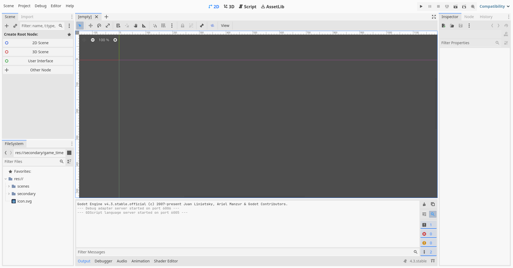
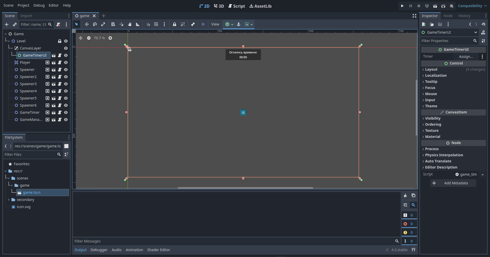
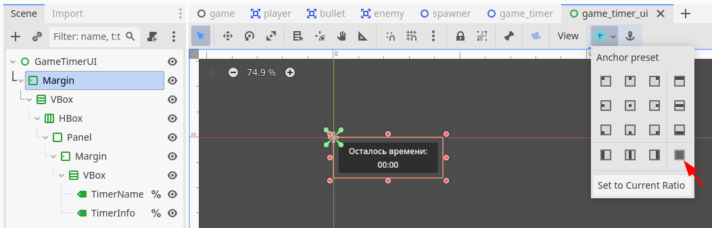

# Реализация

> 📝 Обращаю внимание!
>
> Данный проект является примерным представлением идеи, описанной здесь: [2D Top-Down Simple Shooter](idea-ru.md)

## Содержание

- [Краткий экскурс интерфейса Godot](#краткий-экскурс-интерфейса-godot)
- [Изначальная структура проекта](#изначальная-структура-проекта)
- [Настройка проекта](#настройка-проекта)
- [Создание сцены уровня](#создание-сцены-уровня)
- [Создание игрока](#создание-игрока)
 	- [Код игрока](#код-игрока)
- [Создание пули](#создание-пули)
 	- [Код пули](#код-пули)
 	- [Дополним код игрока](#дополним-код-игрока)
- [Создание врага](#создание-врага)
 	- [Код врага](#код-врага)
- [Тестируем](#тестируем)
- [Создание точки появления врагов](#создание-точки-появления-врагов)
 	- [Код спавнера](#код-спавнера)
- [Создание таймера](#создание-таймера)
 	- [Код таймера](#код-таймера)
- [Создание интерфейса таймера](#создание-интерфейса-таймера)
 	- [Код интерфейса таймера](#код-интерфейса-таймера)
- [Создание менеджера](#создание-менеджера)
 	- [Подготовка](#подготовка)
 	- [Код менеджера](#код-менеджера)
- [Что дальше?](#что-дальше)
- [Немного открытий 🎆](#немного-открытий-)

## Краткий экскурс интерфейса Godot

[Содержание](#содержание)


<p align="center">Рисунок 1 – Стандартный макет интерфейса редактора</p>


<p align="center">Рисунок 2 – Пример непосредственной работы в редакторе</p>

Если кратко:

- Самая верхняя сторона слева: блоки меню работы со сценой, проектом, отладкой и редактором, а также блок меню помощи и показа другой информации о движке;
- Левая верхняя сторона: `Scene` – дерево текущей сцены, `Import` – параметры импорта ресурсов проекта;
- Левая нижняя сторона: `Filesystem` – дерево проекта;
- Самая верхняя часть по середине: `2D` – просмотр текущей сцены в 2D пространстве (2D игры, графический интерфейс), `3D` – просмотр текущей сцены в 3D пространстве (3D игры), `Script` – редактирование кода (подсказки только для GDScript), `AssetLib` – библиотека публичных ресурсов;
- Центральная часть: вкладки открытых сцен, панель инструментов, просмотр сцены и взаимодействие с её узлами;
- Нижняя часть по середине: `Output` – панель вывода отладочной информации, `Debugger` – панель инструментов отладки проекта, `Audio` – панель микшеров проекта, `Animation` – панель взаимодействия с анимационными дорожками, `Shader Editor` – панель редактора шейдеров;
- Правая верхняя сторона: кнопки запуска проекта – запустить весь проект, поставить запущенный проект на паузу, остановить проект, удалённо запустить проект (Web, Android), запустить текущую редактируемую сцену, запустить конкретную сцену с помощью окна выбора сцены, включить функцию записи работы проекта средствами движка, выбор средства визуализации проекта (`Forward+` – использует `Vulkan`, только для `desktop` устройств; `Mobile` – использует `Vulkan`, для ПК / мобильных устройств; `Compatibility` – использует `OpenGL 3`, для ПК / мобильных устройств и Web платформ)
- Правая сторона: `Inspector` – просмотр свойств выбранного узла на сцене, взаимодействие и просмотр документации его класса; `Node` – просмотр и взаимодействие с сигналами и группами выбранного узла; `History` – просмотр истории изменений внутри сцены и / или всего проекта.

## Изначальная структура проекта

[Содержание](#содержание)

- Корень
  - Папка `scenes`
  - Папка `secondary`
  - Файл `icon.svg` (стандартный)

## Настройка проекта

[Содержание](#содержание)

В настройках проекта делаю следующее: (`Project` ➡ `Project Settings`)

- Во вкладке `General` изменяю значения
  - `Viewport Width` и `Viewport Height` (`Display` ➡ `Window` ➡ `Size`) на `1280` и `720` соответственно
  - `Mode` и `Aspect` (`Display` ➡ `Window` ➡ `Stretch`) на `canvas_items` и `expand` соответственно
- Во вкладке `Input Map` добавляю действия (поле `Add New Action`)
  - `forward`: `W` и `Up` (стрелка вверх), `backward`: `S` и `Down` (стрелка вниз), `right`: `D` и `Right` (стрелка направо), `left`: `A` и `Left` (стрелка налево)
    - У всех выбран `Keycode (Latin Equivalent)`
  - `shoot`: `LMB` (Левая Кнопка мыши)

## Создание сцены уровня

[Содержание](#содержание)

Говоря в целом, тип родительского объекта может быть и `Node`, и `Node2D`. В моём случае, пускай это будет тип `Node`.
Структура будет следующей:

- `Game` (тип `Node`)
  - `Level` (тип `Node2D`)
    - `CanvasLayer`

> По ходу текста вы можете самостоятельно добавлять игрока, врагов и т.д. Можете время от времени перемещаться в подзаголовок "[Тестируем](#тестируем)".

Сцену сохраняю в новую папку `game` внутри папки `scenes`, название сцены соответствующее.

## Создание игрока

[Содержание](#содержание)

Я не стал использовать узел `CharacterBody2D`, вместо него использовал `Area2D`. Учитывается, что у каждого узла внутри игрока позиция равняется `(x: 0, y: 0)`.
Структура будет следующей:

- `Player` (тип `Area2D`)
  - `Sprite2D`: в качестве спрайта использовал файл `icon.svg`, масштаб узла: `(x: 0.25, y: 0.25)`
  - `CollisionShape2D` (используется `RectangleShape2D` размером `(x: 30, y: 30)`)
  - `ShootDelay` (тип `Timer`; время ожидания: `0.15`, `One Shot`: `true`)

Сцену сохраняю в новую папку `player` внутри папки `secondary`, название сцены соответствующее.
К родительскому узлу `Player` добавляю пустой GDScript с идентичным названием, что и у объекта.

### Код игрока

```gdscript
class_name Player extends Area2D

# const BULLET

var health := 10

var speed := 100.0
var speed_multiplier := 3.0

@onready var shoot_delay: Timer = $ShootDelay

func _physics_process(delta: float) -> void:
	# Создаётся вектор направления от (-1,-1) до (1,1)
	# Направления:
	# - Отрицательные значения: left, forward;
	# - Положительные значения: right, backward;
	# Объясняется это тем, что координата (0,0) - левый верхний угол экрана
	# По горизонтали (слева направо) : (-X,0,X+)
	# По веритикали  (сверху вниз)   : (-Y,0,Y+) 
	var direction_x := Input.get_axis("left", "right")
	var direction_y := Input.get_axis("forward", "backward")
	
	var velocity := Vector2(direction_x, direction_y)
	velocity = velocity.normalized()
	velocity = velocity * speed * speed_multiplier * delta
	
	position += velocity

func take_damage(value: int) -> void:
	health -= value
	print("Здоровье игрока: ", health)
	_check_damage()

func _check_damage() -> void:
	if health <= 0:
		print("Игрок погиб!")
		queue_free()
```

## Создание пули

[Содержание](#содержание)

Структура будет следующей:

- `Bullet` (тип `Area2D`)
  - `Sprite2D`: в качестве спрайта `icon.svg`, включил `Region`, `region_rect`: `(x: 34, y: 40, w: 60, h: 60)`, масштаб узла: `(x: 0.1, y: 0.1)`, `modulate` (вкладка `Visibility`): `00ff00` (зелёный)
  - `CollisionShape2D` (используется `RectangleShape2D` размером `(x: 7, y: 7)`)
  - `VisibleOnScreenNotifier2D`
  - `Timer` (`One Shot`: `true`)

Сцену сохраняю в новую папку `bullet` внутри папки `secondary`, название сцены соответствующее.
К родительскому узлу `Bullet` добавляю пустой GDScript с идентичным названием, что и у объекта.

### Код пули

```gdscript
class_name Bullet extends Area2D

var damage := 1

var speed := 100.0
var speed_multiplier := 5.0

@onready var timer: Timer = $Timer

func _physics_process(delta: float) -> void:
	position += transform.x * speed * speed_multiplier * delta

# Привяжите сигнал "screen_exited" у "VisibleOnScreenNotifier2D"
func _on_visible_on_screen_notifier_2d_screen_exited() -> void:
	timer.start()

# Привяжите сигнал "timeout" у "Timer"
func _on_timer_timeout() -> void:
	queue_free()
```

### Дополним код игрока

Раскомментируйте строку `const BULLET`, убрав `#` и допишите её:

```gdscript
const BULLET := preload("res://secondary/bullet/bullet.tscn")
```

Также допишите код функции `_physics_process`:

```gdscript
func _physics_process(delta: float) -> void:
	# Предыдущий код наверху не изменился
	
	if Input.is_action_pressed("shoot"):
		if shoot_delay.is_stopped():
			var bullet := BULLET.instantiate()
			bullet.global_position = global_position
			bullet.look_at(get_global_mouse_position())
			get_parent().add_child(bullet)
			shoot_delay.start()
```

## Создание врага

[Содержание](#содержание)

Структура будет следующей:

- `Enemy` (тип `Area2D`)
  - `Sprite2D`: в качестве спрайта `icon.svg`, масштаб узла: `(x: 0.25, y: 0.25)`, `modulate` (вкладка `Visibility`): `ff0000` (красный)
  - `CollisionShape2D` (используется `RectangleShape2D` размером `(x: 32, y: 32)`)
  - `DamageDelay` (тип `Timer`; `One Shot`: `true`)

Сцену сохраняю в новую папку `enemy` внутри папки `secondary`, название сцены соответствующее.
К родительскому узлу `Enemy` добавляю пустой GDScript с идентичным названием, что и у объекта.

### Код врага

```gdscript
class_name Enemy extends Area2D

const SPEED_MULTIPLIER_MIN := 1.0
const SPEED_MULTIPLIER_MAX := 2.5

const HEALTH_MIN := 1
const HEALTH_MAX := 5

# Делаем её публичной на уровне редактора,
# чтобы было удобно на начальном этапе цеплять игрока
@export var player: Player
var is_touches_player: bool

var speed := 100.0
var speed_multiplier: float

var damage := 1

var health: int

@onready var damage_delay: Timer = $DamageDelay

func _ready() -> void:
	speed_multiplier = randf_range(SPEED_MULTIPLIER_MIN, SPEED_MULTIPLIER_MAX)
	health = randi_range(HEALTH_MIN, HEALTH_MAX)

func _physics_process(delta: float) -> void:
	var velocity := Vector2.ZERO
	
	# Преследуем игрока только тогда, когда он существует (не погиб)
	if is_instance_valid(player):
		var target_position := player.global_position
		velocity = global_position.direction_to(target_position)
		velocity = velocity * speed * speed_multiplier * delta
		position += velocity

func _take_damage(value: int) -> void:
	health -= value
	print("Здоровье %s: %s" % [name, health])
	_check_health()

func _check_health() -> void:
	if health <= 0:
		print("%s погиб!" % [name])
		queue_free()

# Привяжите сигнал "area_entered" у "Enemy"
func _on_area_entered(area: Area2D) -> void:
	if area is Bullet:
		_take_damage(area.damage)
		area.queue_free()
	if area is Player:
		is_touches_player = true
		if damage_delay.is_stopped():
			player.take_damage(damage)
			damage_delay.start()

# Привяжите сигнал "area_exited" у "Enemy"
func _on_area_exited(area: Area2D) -> void:
	if area is Player:
		is_touches_player = false

# Привяжите сигнал "timeout" у "DamageDelay"
func _on_damage_delay_timeout() -> void:
	if is_touches_player:
		player.take_damage(damage)
		damage_delay.start()
```

## Тестируем

[Содержание](#содержание)
> По ходу текста, вы уже могли проверять работоспособность игрока, пули и врага, но, может быть, появились вопросы.

Вернитесь на сцену `Game`, нажмите на узел `Level`, `ПКМ` ➡ `Instantiate Child Scene…`, чтобы добавить объекты на уровень. Например, после добавления `Player` на уровень, давайте переместим его в центр экрана с помощью изменения `position` на `(x: 1280 / 2, y: 720 / 2)`, а `Enemy` расположим где-нибудь неподалёку от игрока, зайдём в свойства врага и найдём свойство `Player`. Как я написал в комментариях в коде врага, `@export` даёт возможность на уровне редактора видеть переменную `player`.

Нажмите на кнопку `Assign...` у свойства `Player` и в открывшемся окне выбора узла выберите единственный на уровне узел `Player`.

Нажмём на клавишу `F5`, чтобы запустить проект. При первом нажатии движок спросит, какую сцену сделать главной (какая сцена у игры будет запускаться первой). Можно вручную выбрать (кнопка `Select`), можно выбрать ту, которая редактируется прямо сейчас (если вы были в последний раз в сцене `Game`, то выберется сцена `Game`; кнопка `Select Current`), а можно вообще ничего не выбирать, нажать кнопку `Cancel` и нажать на клавишу `F6`, чтобы запустить редактируемую на данный момент сцену.

> Но, рано или поздно, вам придётся выбрать главную сцену для запуска игры 😊

Как мы сделали в самом начале, персонаж управляется с помощью `WASD` или стрелок на клавиатуре, для стрельбы используется `ЛКМ`.

## Создание точки появления врагов

[Содержание](#содержание)

Структура будет следующей:

- `Spawner` (тип `Node2D`)
 	- `Delay` (тип `Timer`; `One Shot`: `true`)

Сцену сохраняю в новую папку `spawner` внутри папки `secondary`, название сцены соответствующее.
К родительскому узлу `Spawner` добавляю пустой GDScript с идентичным названием, что и у объекта.

### Код спавнера

```gdscript
class_name Spawner extends Node2D

const SPAWN_COUNT_MIN := 1
const SPAWN_COUNT_MAX := 5

const SPAWN_DELAY_MIN := 5.0
const SPAWN_DELAY_MAX := 10.0

const ENEMY := preload("res://secondary/enemy/enemy.tscn")

@export var enable: bool = true
@export var player: Player

@onready var delay: Timer = $Delay

func _ready() -> void:
	_rand_delay_time()

func _rand_delay_time() -> void:
	if not delay.is_stopped():
		delay.stop()
	delay.wait_time = randf_range(SPAWN_DELAY_MIN, SPAWN_DELAY_MAX)
	delay.start()

# Привяжите сигнал "timeout" у "Delay"
func _on_delay_timeout() -> void:
	if is_instance_valid(player) and enable:
		if not delay.is_stopped():
			delay.stop()
		var rand_count := randi_range(SPAWN_COUNT_MIN, SPAWN_COUNT_MAX)
		for i: int in range(rand_count):
			var enemy := ENEMY.instantiate()
			var rand_position := Vector2(randf_range(-10, 10), randf_range(-10, 10))
			enemy.player = player
			enemy.global_position = global_position + rand_position
			get_parent().add_child(enemy)
		_rand_delay_time()
```

> Можете попробовать данный объект в деле! Добавьте его на уровень и привяжите его свойство `Player` к игроку. Можете удалить отдельного врага, а также продублировать спавнер и разместить объекты то тут, то там.
>
## Создание таймера

[Содержание](#содержание)

Структура будет следующей:

- `GameTimer` (тип `Node2D`)
 	- `Delay` (тип `Timer`)

Также, нам понадобиться добавить данный объект в определённую группу. Нажмите на родительский узел (`GameTimer`), нажмите на вкладку `Node` ➡ `Groups` ➡ `+` ➡ назовите группу `GameTimer` ➡ `OK`. Созданная группа понадобится в будущем.
Сцену сохраняю в новую папку `game_timer` внутри папки `secondary`, название сцены соответствующее.
К родительскому узлу `GameTimer` добавляю пустой GDScript с идентичным названием, что и у объекта.

### Код таймера

```gdscript
class_name GameTimer extends Node2D

signal timeout

@export var seconds: int = 60
var time_left: int

@onready var delay: Timer = $Delay

func _ready() -> void:
    time_left = seconds
    delay.start()

func _check() -> void:
    if time_left <= 0:
        delay.stop()
        timeout.emit()

# Привяжите сигнал "timeout" у "Delay"
func _on_delay_timeout() -> void:
	time_left -= 1
	_check()
```

Думаю, вы заметили кое-что новенькое. Мы определили у таймера сигнал `timeout`. Он пригодится, когда мы будем создавать [менеджера](#создание-менеджера).

## Создание интерфейса таймера

[Содержание](#содержание)

Нужно ли нам видеть оставшееся время у таймера? Конечно!
Структура будет следующей:

- `GameTimerUI` (тип `Control`): растянем узел на весь экран сцены: `Layout` ➡ `anchors_preset`: `Full Rect`; с таким же успехом это можно сделать с помощью выделенных кнопок в конце панели инструментов под вкладками сцен (рисунок 3)
 	- `Margin` (тип `MarginContainer`): изменяем значения отступов от краев экрана к середине: `Theme Override` ➡ `Constants`: `10`
  		- `VBox` (тип `VBoxContainer`)
   			- `HBox` (тип `HBoxContainer`, `Alignment`: `Center`)
    				- `Panel` (тип `PanelContainer`)
     					- `Margin` (тип `MarginContainer`): `Theme Override` ➡ `Constants`: `Margin Left / Right`: `20`, `Margin Top / Bottom`: `5`
      						- `VBox` (тип `VBoxContainer`)
       							- `TimerName` (тип `Label`): текст `"Осталось времени:"`, `Horizontal Alignment`: `Center`, `ПКМ` по узлу ➡ `Access as Unique Name`
       							- `TimerInfo` (тип `Label`): текст `00:00` можете не писать, `Horizontal Alignment`: `Center`, `ПКМ` по узлу ➡ `Access as Unique Name`
 	- `Timer` (`Autostart`: `true`)


<p align="center">Рисунок 3 – Растянуть узел на весь экран сцены</p>

Сцену сохраняю в новую папку `game_timer_ui` внутри папки `secondary`, название сцены соответствующее.
К родительскому узлу `GameTimerUI` добавляю пустой GDScript с идентичным названием, что и у объекта.

### Код интерфейса таймера

```gdscript
class_name GameTimerUI extends Control

@export var timer: GameTimer

@onready var timer_name: Label = %TimerName
@onready var timer_info: Label = %TimerInfo

func _process(_delta: float) -> void:
	if is_instance_valid(timer):
		var raw_seconds := timer.time_left
		var minutes: int = floor(float(raw_seconds % 3600) / 60)
		var seconds: int = raw_seconds % 60
		timer_info.text = "%02d:%02d" % [minutes, seconds]

# Привяжите сигнал "timeout" у "Timer"
func _on_timer_timeout() -> void:
	if not is_instance_valid(timer):
		timer = get_tree().get_first_node_in_group("GameTimer")
```

> Можно протестировать таймер и его интерфейс. `GameTimer` должен быть дочерним объектом `Level`, а `GameTimerUI` – `CanvasLayer`.
>
## Создание менеджера

[Содержание](#содержание)

Вот мы и дошли до завершающей части! Давайте создадим менеджера, который будет подписан на сигнал `timeout` у `GameTimer`, находить спавнеры врагов, самих врагов и игрока на уровне.
Структура будет следующей:

- `GameManager` (тип `Node2D`)
Сцену сохраняю в новую папку `game_manger` внутри папки `secondary`, название сцены соответствующее.

### Подготовка

Прежде чем напишем код для менеджера, давайте вернёмся к созданным объектам и каждого перечисленного ниже добавим в свою группу:

| Объекты   | Группы    |
| --------- | --------- |
| Player    | Player    |
| Enemy     | Enemy     |
| Spawner   | Spawner   |
| GameTimer | GameTimer |

С помощью групп, менеджер будет находить нужные объекты на уровне и взаимодействовать с ними.

### Код менеджера

К родительскому узлу `GameManger` добавляю пустой GDScript с идентичным названием, что и у объекта.

```gdscript
class_name GameManager extends Node2D

@export var player: Player

var game_over: bool

func _ready() -> void:
	var timer: GameTimer = get_tree().get_first_node_in_group("GameTimer")
	if timer:
		timer.timeout.connect(_on_timeout)
	else:
		push_error("Таймера нет на сцене!")
	
	if not is_instance_valid(player):
		player = get_tree().get_first_node_in_group("Player")
		if not player:
			push_error("Игрока нет на сцене!")
		
	var spawners := get_tree().get_nodes_in_group("Spawner")
	for spawner: Spawner in spawners:
		spawner.player = player

func _process(_delta: float) -> void:
	if game_over:
		var enemies := get_tree().get_nodes_in_group("Enemy")
		if enemies.size() > 0:
			for enemy: Enemy in enemies:
				enemy.queue_free()

func _on_timeout() -> void:
	game_over = true
	var spawners := get_tree().get_nodes_in_group("Spawner")
	for spawner: Spawner in spawners:
		spawner.enable = false
```

## Что дальше?

[Содержание](#содержание)

Можно развивать данный проект:

- Добавив отображение жизней игрока
- Добавив отображение жизней врагов
 	- Подсказка: лучше это делать внутри объекта `Enemy`
- Добавив показ сообщения об окончании игры
- Добавив показ сообщения о смерти персонажа с возможностью перезапустить уровень

## Немного открытий 🎆

[Содержание](#содержание)
> Конструкция `:=` в языке GDScript позволяет движку самостоятельно определять тип переменной во время присвоения значения.
>
> Если вы хотите подробнее узнать про функцию (например, `look_at`) или переменную в движке, или сделать что-то ещё, попробуйте нажать клавишу `Control` (`CTRL`, не важно, какая) чтобы открыть встроенную в движок документацию.
>
> Если нажмёте на строку кода или выделите несколько строк и на английской раскладке клавиатуры нажмёте сочетание клавиш `CTRL`+`/`, то вы оформите комментарий или наоборот, уберёте данное оформление.
